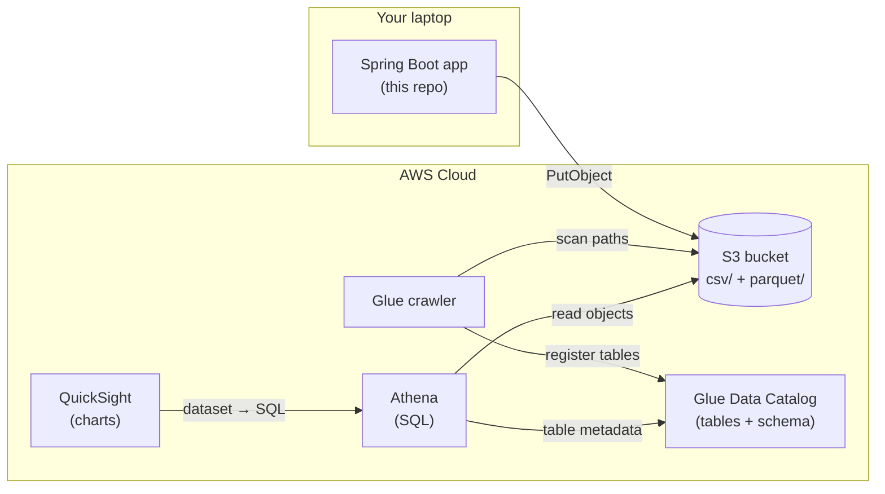
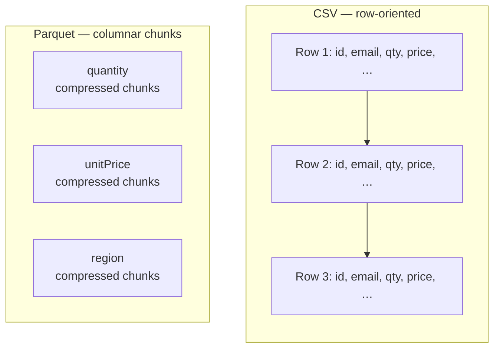
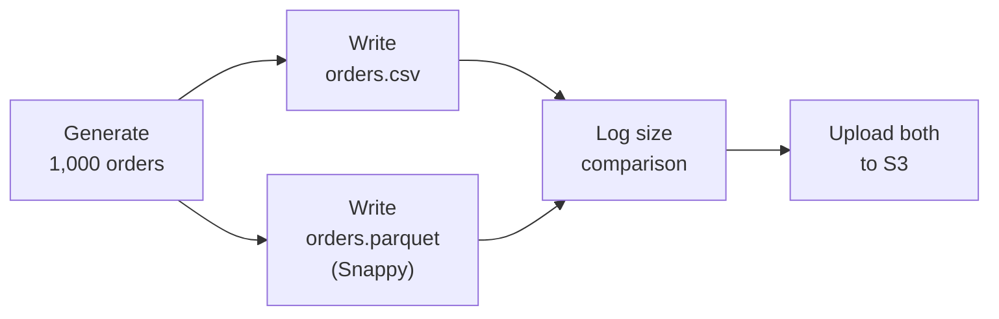
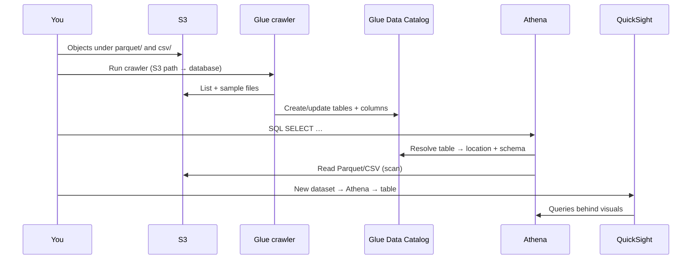
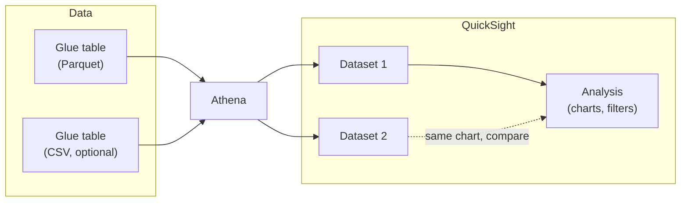

# Parquet demo for developers

A small **end-to-end “hello world”** that shows how the same data looks as **CSV** vs **Apache Parquet**, why Parquet is useful for analytics, and how to get that data into **Amazon QuickSight** via **S3**, **AWS Glue**, and **Athena**.

### Architecture at a glance



*If diagrams do not render in your viewer, open this file [on GitHub](https://github.com/sherwin-tbd-health/parquet-demo) or paste the code blocks into [Mermaid Live Editor](https://mermaid.live).*

---

## What you will learn

| Topic | This demo shows |
|--------|------------------|
| **Parquet basics** | Columnar storage, embedded schema, compression (Snappy) |
| **CSV vs Parquet** | Side-by-side file size on disk for the same 1,000 rows |
| **Cloud analytics path** | S3 → Glue (catalog) → Athena (SQL) → QuickSight (charts) |

---

## Why Parquet is often better than CSV for analytics

**In one sentence:** for analytics over large datasets in S3 (or similar), Parquet is usually a better *default* than CSV because it stores data **by column**, **compresses** well, carries an explicit **schema**, and lets query engines **read less data** from disk—which often means **faster queries** and **lower cost** (for example, less data scanned in Athena).

That does not make CSV “bad.” CSV is ubiquitous, easy to produce, and trivial to open in a spreadsheet. The tradeoff shows up when the same files are read **many times** by **machines** (BI tools, SQL engines, Spark jobs) rather than edited by hand.

The points below are intentionally simplified for onboarding; real workloads differ in cardinality, compression, partitioning, and query patterns.

1. **Smaller on disk** — Values in the same column tend to look alike, so columnar compression (here: **Snappy**) usually beats storing the same rows as plain text CSV.
2. **Schema in the file** — Types (`int`, `double`, etc.) are explicit; CSV is untyped text until something parses it and guesses types.
3. **Column pruning** — Engines can read only the columns referenced in `SELECT`; with CSV they typically scan whole rows (all columns) to answer the same query.
4. **Predicate pushdown & statistics** — Parquet files group data into **row groups** with min/max (and other) stats so engines can **skip** chunks that cannot match a `WHERE` clause. See [Amazon Athena’s columnar storage guide](https://docs.aws.amazon.com/athena/latest/ug/columnar-storage.html) for how this helps Athena.
5. **Fits the AWS analytics stack** — Glue, Athena, EMR, Redshift Spectrum, and QuickSight (via Athena) are built to work well with Parquet in S3.

**When CSV is still the right tool:** one-off exports, human editing, quick scripts, tiny data, or systems that only speak CSV. **When Parquet tends to win:** shared **data lake** or **warehouse** files that many services query repeatedly.

### Further reading (Parquet)

| Resource | Why it’s useful |
|----------|------------------|
| [Apache Parquet — home](https://parquet.apache.org/) | Short official description: columnar format, compression, broad tool support. |
| [Apache Parquet — documentation](https://parquet.apache.org/docs/) | Deeper material: concepts, encodings, and links to the format spec. |
| [Use columnar storage formats (Amazon Athena)](https://docs.aws.amazon.com/athena/latest/ug/columnar-storage.html) | AWS-oriented: why Parquet/ORC help Athena (compression, predicate pushdown, parallelism). |
| [Apache Parquet (Wikipedia)](https://en.wikipedia.org/wiki/Apache_Parquet) | Quick historical and conceptual overview with references. |
| [parquet-format (GitHub)](https://github.com/apache/parquet-format) | Low-level **format specification** if you want to see how files are structured on disk. |

### Row-oriented CSV vs columnar Parquet (conceptual)

CSV stores **whole rows** one after another—fine for reading a file top-to-bottom, but analytics engines often pay for **every column** in each row even when they only need a few. Parquet groups **values by column** in compressed chunks, so engines can **skip columns** and compress similar values together.



---

## What this app does

When you run it, it:

1. Generates **1,000** synthetic **order** records.  
2. Writes **`orders.csv`** (local).  
3. Writes **`orders.parquet`** (local, Snappy-compressed).  
4. Logs a **size comparison** (CSV vs Parquet).  
5. Uploads both to your S3 bucket:  
   - `s3://<your-bucket>/csv/orders.csv`  
   - `s3://<your-bucket>/parquet/orders.parquet`

After that, you use **Glue** + **Athena** + **QuickSight** to query and visualize—same pattern your team would use on a real lake.

### What runs on your machine (pipeline)



---

## Prerequisites

- **Java 17** (project uses Gradle’s Java toolchain).  
- **AWS account** you can use for S3, Glue, Athena, and QuickSight.  
- **AWS credentials** on your machine (for example [AWS CLI](https://docs.aws.amazon.com/cli/latest/userguide/cli-chap-configure.html) `aws configure`, or environment variables / SSO—whatever your org uses).  
- An **S3 bucket** in the region you configure (create it in the console or with CLI).

---

## 1. Clone, build, configure

```bash
./gradlew clean build
```

Edit `src/main/resources/application.properties`:

```properties
demo.s3.bucket=your-bucket-name-here
demo.s3.region=us-east-1
```

Use a bucket in the same **region** as `demo.s3.region`.

**IAM (minimal idea):** the identity used by the app needs `s3:PutObject` (and usually `s3:ListBucket` on the bucket) for the `csv/` and `parquet/` prefixes. Tighten to your org’s standards.

---

## 2. Run the demo locally

```bash
./gradlew bootRun
```

Watch the logs: you should see file sizes for CSV vs Parquet and confirmation that both objects landed in S3.

You will also have **`orders.csv`** and **`orders.parquet`** in the project root if you want to open them locally (Parquet is binary—use a Parquet viewer or Athena/Glue, not a text editor).

---

## 3. AWS: catalog the data with Glue

Goal: put **tables** in the **Glue Data Catalog** that point at your S3 prefixes so Athena (and then QuickSight) can query them.

### How Glue, Athena, and QuickSight connect



### 3a. Create a Glue database

1. Open **AWS Glue** → **Data catalog** → **Databases** → **Add database**.  
2. Name it something like `parquet_demo`.  
3. Create.

### 3b. Crawler for Parquet

1. **Crawlers** → **Create crawler**.  
2. **Data sources**: add an **S3** source; path `s3://your-bucket/parquet/` (trailing slash is fine).  
3. **IAM role**: use a role that can read your bucket and write to the Glue catalog (the console can create one).  
4. **Target**: database `parquet_demo`, optional table prefix.  
5. Run the crawler.  
6. Under **Tables**, confirm a table was created (name may reflect the folder, e.g. `parquet`).

### 3c. Crawler for CSV (optional but recommended for the comparison)

Repeat with S3 path `s3://your-bucket/csv/`. You may get a table named like `csv`. If the crawler mis-guesses types, you can still use it for a quick QuickSight demo or adjust the classifier / schema in Glue later.

---

## 4. Athena: run a test query

1. Open **Amazon Athena**.  
2. **Settings** → specify a **query result location** in S3 (any bucket/prefix you use for Athena output).  
3. Select the **workgroup** and **database** `parquet_demo`.  
4. Run something like:

```sql
SELECT *
FROM parquet_demo.<your_parquet_table_name>
LIMIT 10;
```

Replace `<your_parquet_table_name>` with the name Glue created. Do the same for the CSV table if you crawled it.

If queries fail, check: crawler finished, correct database, table location matches `s3://.../parquet/` or `s3://.../csv/`, and IAM allows Athena to read the data and write results.

---

## 5. QuickSight: visualize (the UI walkthrough)

These steps assume **QuickSight** is enabled in your account and you can sign in.

### From dataset to dashboard (mental model)



You typically create **one dataset per table** (or custom SQL), then build an **analysis** with visuals and filters.

### 5a. First-time setup (once per account/region)

1. In QuickSight, open the menu (user icon) → **Manage QuickSight** (or **Security & permissions** depending on UI version).  
2. Ensure **Amazon Athena** is allowed as a data source.  
3. If prompted, grant QuickSight permission to read your S3 buckets used by Athena/Glue (QuickSight may offer to auto-discover or you attach policies—follow your admin’s pattern).

### 5b. Create a dataset from Athena

1. QuickSight home → **Datasets** → **New dataset**.  
2. Choose **Athena**.  
3. **Data source name**: e.g. `athena-parquet-demo` → **Create data source**.  
4. **Database**: `parquet_demo`.  
5. **Table**: pick the **Parquet** table Glue created.  
6. Choose **Select** → **Directly query your data** or **SPICE** (for a tiny demo, either works; SPICE refreshes on a schedule, direct query hits Athena each time).  
7. **Edit/preview** → **Save & publish**.

### 5c. Build a simple analysis

1. **Create analysis** from that dataset.  
2. Drag **region** or **product** to the **X axis** and **quantity** or a **count** to **Value**—a simple bar chart is enough for a “hello world.”  
3. Add a **filter** (e.g. `orderStatus`) to show that the dashboard reacts to field types Glue inferred from Parquet.

### 5d. (Optional) Compare to CSV

Create a **second dataset** pointing at the **CSV** table. Build the same chart. Discuss: file size in S3, query performance at larger scale, and type fidelity—this is the teaching moment.

---

## Project layout (reference)

| Path | Role |
|------|------|
| `DemoRunner.java` | Orchestrates generate → CSV → Parquet → S3 |
| `ParquetWriter.java` | Writes Snappy Parquet with an explicit Avro schema |
| `CsvWriter.java` | Writes CSV for comparison |
| `application.properties` | `demo.s3.bucket`, `demo.s3.region` |

---

## Troubleshooting

| Symptom | Things to check |
|---------|-------------------|
| `Access Denied` on upload | IAM for `PutObject` / bucket policy; correct region and bucket name. |
| Glue crawler creates no table | S3 path includes the files; crawler IAM can list/read the bucket. |
| Athena “Table not found” | Database name; table name from Glue; crawler run succeeded. |
| QuickSight cannot see Athena | QuickSight ↔ Athena permissions; author is in the right QuickSight account/region. |

---

## Next steps for your team

- Increase row count and re-run; watch **Parquet vs CSV** size and (in Athena) **scanned data** when you **select only a few columns** on Parquet.  
- Add **partitions** (e.g. `s3://bucket/parquet/order_date=2025-01-01/...`) and teach **partition pruning** in Athena.  
- Align on **Glue** as the source of truth for schemas and **data contracts** for producers.

This repo stays intentionally small: **one runnable app**, **two files in S3**, **one chart in QuickSight**—enough to repeat the whole path yourself.
